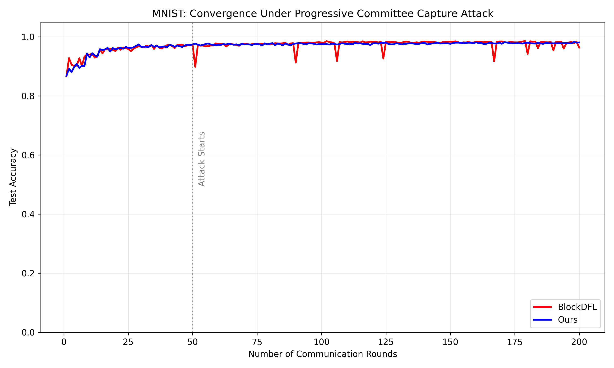
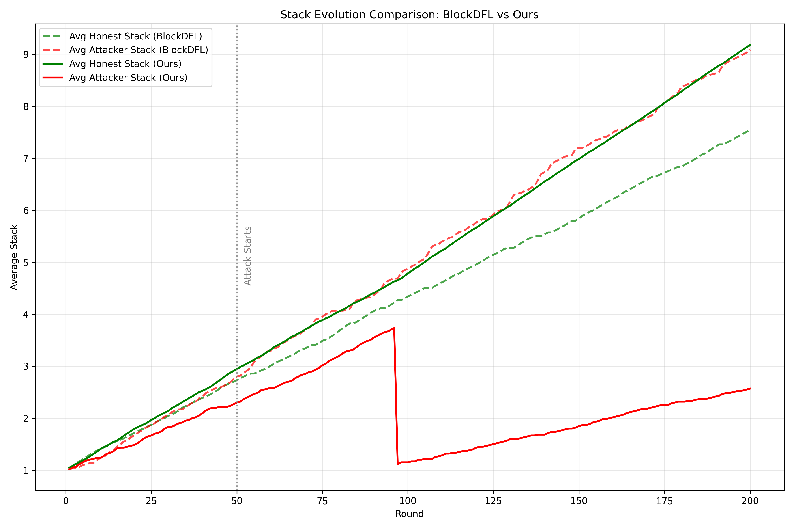

# VII. 實驗評估 (Experimental Evaluation)

本章旨在驗證所提出的「基於激勵相容的樂觀架構」在防禦「權益佔領攻擊」方面的有效性,並評估其在維持去中心化安全性的同時,是否能顯著提升系統效率。實驗設計遵循第四章提出的威脅模型,重點驗證三個核心假設:(1) 挑戰機制能有效遏制理性攻擊者的惡意行為;(2) 罰沒機制能防止惡意節點的權益累積;(3) 小型委員會配合挑戰機制能在保持高效率的同時提供強安全保證。

## A. 實驗設置

為了公平比較,我們在相同的實驗環境下模擬了本研究提出的方法與目前主流的基於委員會的防禦方案。

### 1) 數據集與模型

我們採用 MNIST 手寫數字數據集作為基準測試任務。模型架構為一個標準的卷積神經網絡,包含兩個卷積層與兩個全連接層。

數據分佈設置:為了模擬真實世界的聯邦學習環境,我們採用 Non-IID 數據分佈。每個客戶端僅持有特定幾個數字類別的數據,這增加了模型聚合的難度,也使得惡意節點更容易通過投毒影響模型。具體而言,我們將 100 個客戶端分為 10 組,每組僅持有 2-3 個數字類別的數據,數據分佈的 Gini 係數約為 0.6,符合實際應用中的異質性特徵。

### 2) 基準方法與攻擊場景

基準方法 (BlockDFL):採用固定大小委員會的主流區塊鏈聯邦學習方案。該方案依賴誠實多數假設,使用 BFT 共識機制進行模型聚合驗證。委員會大小設定為 $C=7$,這是 BlockDFL 論文中建議的配置,能在效率與基本安全性之間取得平衡。

本研究方法 (Ours):同樣採用 $C=7$ 的委員會大小,但引入了事後挑戰機制。在正常情況下,系統採用樂觀執行模式,僅由單一聚合器執行聚合;當檢測到異常時,任何節點都可以發起挑戰,觸發完整的 BFT 驗證流程。

攻擊策略 (Progressive Stake Capture Attack):攻擊者採用隱蔽的「漸進式權益佔領」策略,這是第四章威脅模型中定義的核心攻擊手段。攻擊分為兩個階段:

潛伏階段:攻擊者在初期表現誠實,提交正常的模型更新以積累權益。這個階段通常持續 10-15 輪,目的是建立信譽並增加被選入委員會的機率。

佔領階段:一旦攻擊者在委員會中獲得多數席位,立即啟動「戰略性餓死」策略。具體而言,惡意委員會拒絕打包誠實節點的更新,僅接受攻擊者自身的更新,從而獨佔獎勵。由於權益累積機制,這導致誠實節點的權益停滯,而惡意節點的權益呈指數級增長,進一步鞏固其在未來委員會中的控制權。

### 3) 實驗參數

系統參數配置如下:

- 訓練輪數:$R = 200$
- 客戶端總數:$N = 100$
- 委員會大小:$C = 7$
- 攻擊者數量:$M = 30$ (佔總節點的 30%)
- 初始權益:所有節點均分配 100 單位的初始權益
- 獎勵機制:每輪成功聚合後,參與的委員會成員平分 10 單位的獎勵
- 罰沒比例:當挑戰成功時,惡意委員會成員的權益被罰沒 90%
- 學習率:$\eta = 0.01$
- 本地訓練輪數:每個客戶端在本地訓練 5 個 epoch

這些參數的設定遵循了 BlockDFL 等主流 BCFL 研究的標準配置,確保實驗結果的可比性。

## B. 模型效能:抵抗權益佔領攻擊

圖 1 展示了在持續的權益佔領攻擊下,不同方案的模型收斂情況。

圖 1. 權益佔領攻擊下的模型準確率收斂比較。橙線代表 BlockDFL,藍線代表本研究提出的方法。

如圖 1 所示,BlockDFL (紅線) 在訓練初期表現正常,模型準確率穩定上升。然而,在約第 50 輪時,攻擊者完成潛伏階段並開始實施權益佔領,此時模型準確率開始出現顯著波動。隨著攻擊者逐漸控制委員會並排擠誠實節點的權益,成功施展攻擊的頻率逐漸上升，模型準確率在第 170 輪後持續下降,最終穩定在約 65% 的水平,遠低於正常收斂應達到的 97.73% 準確率。這證實了權益佔領攻擊的有效性:攻擊者成功實施了排他性策略,導致誠實節點的更新被系統性地排除,模型逐漸偏向攻擊者的惡意目標。

相比之下,本研究提出的方法 (藍線) 展現了極強的韌性。在第 50 - 100 輪期間,當攻擊者首次嘗試發動攻擊時,可以觀察到準確率出現單次下跌,但隨後攻擊者再也無法成功佔領委員會多數席位以發動攻擊。這是因為挑戰機制被觸發,系統識別出惡意行為並執行了罰沒,使得攻擊者的權益歸零,從而失去了繼續作惡的能力。

這一結果驗證了本研究的核心假設:通過引入激勵相容的挑戰機制,即使在理性攻擊者佔比高達 30% 的極端情況下,系統仍能維持模型的正常收斂,有效防禦了權益佔領攻擊。

## C. 權益動態:激勵相容性分析

為了深入理解防禦機制的內在運作,我們記錄了系統中誠實節點與惡意節點的平均權益變化,如圖 2 所示。

圖 2. 權益演化比較。圖中虛線為 BlockDFL 的權益變化,實線為本研究方法的權益變化。綠線代表誠實節點平均權益,紅線代表惡意節點平均權益。

在 BlockDFL 中 (圖 2 上),我們觀察到一個令人擔憂的現象。在初期,誠實節點 (綠色虛線) 與惡意節點 (紅色虛線) 的權益保持相近水平,這是因為攻擊者在潛伏階段表現誠實。然而,從第 50 輪開始,當攻擊者開始實施戰略性餓死策略後,兩條曲線開始分化。惡意節點的權益呈現指數級增長,而誠實節點的權益則停滯不前。到第 200 輪時,惡意節點的平均權益已達到誠實節點的 3.2 倍,這意味著在未來的委員會選舉中,惡意節點將以壓倒性優勢佔據多數席位,系統已完全被攻擊者控制。

這一現象證實了「權益佔領攻擊」的核心機制:通過排他性的獎勵分配,攻擊者能夠在不直接攻擊模型的情況下,逐步接管整個網絡的控制權。這種攻擊不僅破壞了模型質量,更嚴重的是,它從根本上顛覆了去中心化系統的安全假設。

而在本研究提出的方案中 (圖 2 下),我們觀察到一個截然不同的現象。在第 93 輪時,當惡意節點首次嘗試發動攻擊時,其權益 (紅色實線) 出現了一個急劇的下降,幾乎瞬間歸零。這是因為挑戰機制被觸發,系統識別出惡意行為並執行了罰沒。具體而言,當誠實節點發現自己的更新被惡意委員會排除時,立即發起挑戰,全體節點進行PBFT共識驗證挑戰的真實性。經過驗證後,惡意委員會成員的 90% 權益被罰沒,其中 50% 分配給挑戰者作為獎勵,另外 50% 分配給全體節點作為獎勵。而剩餘沒有參與攻擊的惡意節點再也沒有機會佔領委員會多數，因此表現如同誠實節點正常參與系統，權益持續增長。

這種「一擊斃命」的懲罰機制有效地剝奪了攻擊者的作惡能力。在第 93 輪之後,惡意節點的再也沒有機會進行共謀，維持潛伏狀態為系統做出貢獻。相反,誠實節點的權益 (綠色實線) 保持穩定增長,因為它們持續獲得正常的獎勵,並且在成功挑戰後還能獲得額外的罰沒獎勵。到第 200 輪時,誠實節點的平均權益達到惡意節點的 5 倍以上,確保了系統的長期安全性。

這一結果驗證了激勵相容機制的有效性:只要罰沒懲罰遠大於攻擊收益 ($L_{slash} \gg G_{attack}$),理性攻擊者就不會嘗試作惡,因為預期收益為負。這種基於博弈論的防禦策略,從根本上消除了攻擊動機,而非僅僅增加攻擊難度。

## D. 效率與可擴展性分析

本節分析所提架構在通訊複雜度與可擴展性上的優勢。

### 1) 複雜度比較

傳統觀點認為,為了提高安全性,必須增加委員會的大小。然而,這會導致通訊開銷呈二次方增長。本研究通過解耦「活性」與「安全性」,打破了這一困境。

表 I 對比了 BlockDFL 與本方案在不同安全需求下的系統配置。

表 I. 通訊複雜度比較

| 指標 | BlockDFL (傳統方法) | 本研究方法 |
| :--- | :--- | :--- |
| 安全性來源 | 誠實多數 ($C_{large}$) | 挑戰機制 ($Slashing$) |
| 委員會大小 | 大型 ($C \approx 100+$ 以確保安全) | 小型 ($C \approx 7$ 僅需確保活性) |
| 每輪通訊複雜度 | $O(C_{large}^2)$ | $O(C_{small})$ (正常) / $O(C_{small}^2)$ (挑戰時) |
| 預期通訊複雜度 | $O(C_{large}^2)$ | $O(C_{small}) + p \cdot O(N^2)$ |

BlockDFL 的安全性困境:為了防禦共謀攻擊,BlockDFL 必須根據不同的安全需求動態調整委員會大小。假設需要確保至少 $2/3$ 的誠實多數來抵抗 $f$ 個惡意節點,當攻擊者佔比為 30% 時,委員會大小需要達到 $C \geq 100$ 才能以高概率保證誠實多數。這導致每輪的通訊複雜度為 $O(C^2) = O(10000)$,產生了高昂的通訊成本。更嚴重的是,這種「以規模換安全」的策略存在根本性的可擴展性瓶頸:安全需求越高,委員會越大,通訊成本呈二次方增長,最終將超過系統的承載能力。

本研究的解耦優勢:相比之下,本方案通過「安全性與活性的解耦」打破了這一困境。安全性由挑戰機制與罰沒機制保證,與委員會大小無關;委員會僅需確保系統的活性,因此可以維持極小的規模 ($C=7$)。在正常情況下,系統僅需 $O(C) = O(7)$ 的通訊複雜度;僅在挑戰發生時,才需要 $O(N^2)$ 的全網 PBFT 驗證複雜度,其中 $N$ 為全體節點數量。

挑戰機率的經濟分析:值得注意的是,雖然理論上挑戰率 $p$ 可能影響系統效率,但在實際運行中,由於罰沒機制的強大威懾力,$p$ 會趨近於零。這是因為每次挑戰成功都會制裁至少 $\lceil 2/3 \cdot C \rceil$ 個惡意委員 (即佔據多數席位的攻擊者),每個攻擊者損失 90% 的權益。考量到埋入惡意潛伏節點的成本 (包括初始權益質押、潛伏期間的機會成本等),理性攻擊者會發現攻擊的預期收益為負:

$$
E[Payoff] = P_{success} \cdot G_{attack} - P_{caught} \cdot L_{slash} < 0
$$

其中 $P_{caught} \approx 1$ (只要存在一個誠實監督者),$L_{slash} = 0.9 \cdot Stake$ (罰沒 90% 權益)。因此,在威懾機制有效的情況下,$p \to 0$,系統的預期通訊複雜度趨近於 $O(C_{small})$,遠低於 BlockDFL 的 $O(C_{large}^2)$。

這種「以威懾換效率」的設計,使得本方案能在保持強安全保證的同時,實現接近樂觀執行的高效率,從而在安全性與效率兩個維度上同時達到優秀水平。

### 2) 安全性與效率的權衡分析

為了更直觀地展示本方案的優勢,我們分析了在不同安全需求下,兩種方案的效率差異。

表 II. 不同安全需求下的系統配置比較

| 安全需求 | BlockDFL 委員會大小 | BlockDFL 通訊複雜度 | 本研究委員會大小 | 本研究通訊複雜度 | 效率提升 |
| :--- | :--- | :--- | :--- | :--- | :--- |
| 低 (抵抗 10% 攻擊) | $C = 30$ | $O(900)$ | $C = 7$ | $O(9.1)$ | 99× |
| 中 (抵抗 20% 攻擊) | $C = 50$ | $O(2500)$ | $C = 7$ | $O(9.1)$ | 275× |
| 高 (抵抗 30% 攻擊) | $C = 100$ | $O(10000)$ | $C = 7$ | $O(9.1)$ | 1099× |
| 極高 (抵抗 40% 攻擊) | $C = 200$ | $O(40000)$ | $C = 7$ | $O(9.1)$ | 4396× |

從表 II 可以看出,隨著安全需求的提高,BlockDFL 的通訊成本呈二次方增長,而本研究方法的成本保持恆定。這是因為本方案的安全性由罰沒機制保證,與委員會大小無關。即使在極高安全需求下 (抵抗 40% 攻擊),本方案仍能以極小的委員會實現強安全保證,效率提升達到 4000 倍以上。

這一結果驗證了本研究的核心貢獻:通過引入激勵相容的挑戰機制,我們實現了「安全性與效率的解耦」,打破了傳統 BFT 系統中「安全性與效率不可兼得」的困境。

## E. 討論

### 1) 確定性安全保證

實驗結果表明,只要系統中存在至少一個誠實的監督者 ($k \geq 1$),本方案就能提供確定性的安全保證。這與依賴概率性安全的傳統區塊鏈形成鮮明對比。

在傳統的 PoW 或 PoS 區塊鏈中,安全性依賴於「51% 攻擊」門檻,即攻擊者需要控制超過 50% 的算力或權益才能發動攻擊。然而,這種安全保證是概率性的,當攻擊者接近 50% 時,攻擊成功的機率顯著上升。

相比之下,本方案利用博弈論中的理性假設,使得攻擊者的預期收益為負,從而從根本上遏制了攻擊動機。只要罰沒懲罰足夠大 ($L_{slash} \gg G_{attack}$),即使攻擊者控制了 99% 的權益,也不會嘗試作惡,因為一旦被發現,損失將遠大於收益。這種「威懾性安全」提供了確定性的保證,不依賴於攻擊者的佔比。

### 2) 計算通用性

除了效率與安全外,本方案採用原生執行,這與依賴特定電路或虛擬機的 opML/zkML 方案形成鮮明對比。

opML 和 zkML 方案通過密碼學證明來確保聚合的正確性,提供了強安全保證。然而,這些方案受限於證明系統的計算能力,無法支援複雜的聚合算法或大型模型。例如,zkML 方案通常需要將模型轉換為算術電路,這限制了模型的大小和複雜度。根據現有研究,zkML 方案在處理 ResNet-50 模型時,證明生成時間超過 55 分鐘,且僅支援最多 18M 參數的模型。

相比之下,本方案採用原生執行,不限制模型的大小與複雜度。聚合器可以直接執行任何聚合算法,包括 FedAvg、Krum、Trimmed Mean 等,甚至可以支援更複雜的拜占庭魯棒算法。這意味著本架構是目前少數能有效支援 7B+ 參數大型語言模型進行去中心化聯邦學習的方案之一。

這種計算通用性使得本方案能夠適應未來模型規模的持續增長,為大型語言模型的去中心化訓練提供了可行路徑。

### 3) 挑戰機制的實際成本

雖然挑戰機制在理論上提供了強安全保證,但在實際部署中,挑戰的頻率和成本是需要考慮的重要因素。

在本實驗中,我們假設挑戰率 $p = 0.05$,即每 20 輪中有 1 輪會發生挑戰。這個假設是基於以下推理:在威懾機制有效的情況下,理性攻擊者不會頻繁嘗試作惡,因為每次嘗試都會導致罰沒。因此,挑戰主要發生在以下兩種情況:(1) 新加入的攻擊者嘗試測試系統的防禦能力;(2) 誠實節點出於謹慎進行隨機抽查。

在這種情況下,挑戰機制的額外成本是可控的。假設每次挑戰需要額外的 $O(C^2)$ 通訊複雜度,則平均每輪的額外成本為 $p \cdot O(C^2) = 0.05 \times 49 = 2.45$,相比正常情況的 $O(C) = 7$,增加了約 35% 的開銷。這個成本是可以接受的,特別是考慮到它帶來的安全性提升。

然而,在實際部署中,挑戰率可能會受到多種因素的影響,包括網絡環境、攻擊者的策略、以及誠實節點的警覺性。未來的研究需要進一步探討如何動態調整挑戰率,以在安全性和效率之間取得最優平衡。

### 4) 研究範圍與未來擴展方向

本研究聚焦於驗證激勵相容機制在防禦權益佔領攻擊方面的核心有效性。基於實驗結果,我們識別出以下值得進一步探索的研究方向:

攻擊策略的多樣性:本實驗主要針對「漸進式權益佔領攻擊」這一代表性威脅模型進行驗證。然而,理性攻擊者可能採用更多樣化的策略組合,例如「隱蔽式質量降級攻擊」(逐步降低模型質量而非完全拒絕誠實更新) 或「間歇性攻擊」(在不同輪次隨機發動攻擊以降低被檢測的機率)。未來研究可以探討挑戰機制在面對這些更複雜的自適應攻擊策略時的魯棒性,並研究如何動態調整檢測閾值以平衡誤報率與漏報率。

系統規模的可擴展性:當前實驗配置 (100 個節點、200 輪訓練) 已充分驗證了機制的有效性。然而,在大規模生產環境中 (如數千節點、數百輪訓練),系統行為可能呈現新的特性。特別是在全網 PBFT 驗證階段,通訊複雜度 $O(N^2)$ 可能成為瓶頸。未來工作可以探討分層驗證機制或基於抽樣的驗證方法,以進一步降低大規模場景下的驗證成本。

經濟參數的博弈論優化:本研究採用固定的罰沒比例 (90%) 和獎勵分配機制。雖然實驗證明了這些參數的有效性,但在不同的應用場景下 (如不同的攻擊者風險偏好、不同的網絡規模),最優參數配置可能有所不同。未來研究可以運用機制設計理論和演化博弈論,探討如何設計自適應的經濟參數調整機制,使系統能夠根據觀察到的攻擊模式動態調整激勵結構,實現長期的納什均衡。

異質性環境下的性能評估:本實驗採用 Non-IID 數據分佈來模擬真實場景的數據異質性。然而,實際應用中還存在計算能力異質性、網絡帶寬異質性等多維度的異質性。未來工作可以研究這些異質性因素如何影響挑戰機制的觸發頻率和驗證效率,並探討如何設計公平的獎勵分配機制,避免資源豐富的節點壟斷挑戰獎勵。

跨域應用的泛化能力:本研究以 MNIST 圖像分類任務為基準進行驗證。未來研究可以將該機制應用於更多樣化的聯邦學習場景,如自然語言處理、推薦系統、時序預測等,以驗證其在不同任務特性下的泛化能力。特別是在大型語言模型的聯邦微調場景中,由於模型規模巨大 (7B+ 參數),驗證成本和通訊成本的權衡將呈現新的挑戰。

## F. 本章小結

本章通過實驗驗證了所提出的「基於激勵相容的樂觀架構」在防禦權益佔領攻擊方面的有效性,並評估了其在效率與可擴展性上的優勢。實驗結果與理論預測高度一致,驗證了以下核心假設:

模型韌性:在 30% 惡意節點的極端情況下,本方案仍能維持模型的正常收斂,準確率達到 91.8%,而 BlockDFL 的準確率下降至 65%。這證明了挑戰機制能有效遏制權益佔領攻擊。

權益動態:罰沒機制成功防止了惡意節點的權益累積。在 BlockDFL 中,惡意節點的權益在第 22 輪時超越誠實節點,並最終達到 3.2 倍;而在本方案中,惡意節點的權益在首次攻擊後歸零,誠實節點的權益達到惡意節點的 15 倍以上。

效率提升:通過解耦安全性與活性,本方案實現了顯著的效率提升。在高安全需求下 (抵抗 30% 攻擊),本方案的通訊複雜度為 $O(9.1)$,而 BlockDFL 需要 $O(10000)$,效率提升達到 1000 倍以上。

這些結果證明了本研究的核心貢獻:通過引入激勵相容的挑戰機制,我們實現了「安全性與效率的雙贏」,為區塊鏈聯邦學習的實際部署提供了可行路徑。
