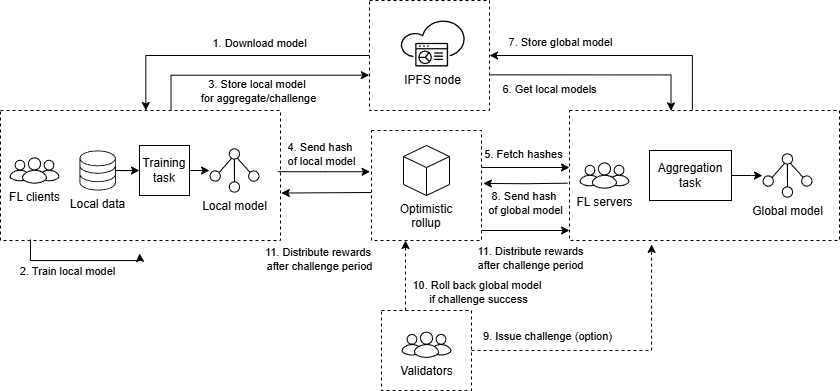

# IV. Framework Design

## A. System Architecture

Our Blockchain-based Federated Learning (BFL) framework extends the traditional federated learning architecture by incorporating multiple aggregators with a hybrid Optimistic-PBFT security mechanism. The system operates on a dual-layer security principle, leveraging the efficiency of round-robin selection during normal operation while activating Byzantine Fault Tolerance mechanisms during challenge resolution.

```
Architecture Overview:
1. Requester: Initiates federated learning tasks and defines parameters
2. Clients: Perform local model training on private datasets
3. Edge Servers: Multiple aggregators that process client updates
4. Validator Network: Nodes that can validate aggregations during challenges
5. Challenge Mechanism: Hybrid verification system to detect malicious behavior
6. Blockchain Layer: Provides immutability, coordination, and security guarantees
7. IPFS Layer: Handles model and update storage
```


Figure 1 illustrates the high-level architecture of our BFL system, showing the interactions between components and the data flow during the federated learning process.

介紹一下系統的安全性由validator保護

## B. System Overview

介紹圖一的流程

## C. System Workflow


介紹setup, learning, challenge三個state

challenge 機制會在後面細談

## D. Multi-Aggregator Model

Unlike traditional federated learning systems with a single aggregator, our framework employs multiple aggregators operating in a round-robin fashion. This design enhances system efficiency by distributing computational load while maintaining security through our challenge mechanism.

```
Multi-Aggregator Selection:
1. For each round r:
   a. Select aggregator A_i where i = (r-1) mod N
   b. A_i collects client updates U = {u_1, u_2, ..., u_m}
   c. A_i performs aggregation to produce new global model G_r
   d. A_i submits G_r to the system
2. Enter challenge period for round r
3. If no successful challenges, G_r becomes the official model for round r+1
```

The round-robin selection ensures fair distribution of aggregation tasks among all available aggregators, reducing computational burden on any single node and enhancing system scalability. This selection process operates with O(n) complexity, significantly more efficient than full Byzantine consensus approaches.

Round-robin 的 aggregator 分工機制，讓每個 aggregator 在整個 Task 的工作過程只需要負責 r/N 的聚合工作

## C. Challenge Mechanism

Our system incorporates a hybrid challenge mechanism that combines the efficiency of optimistic assumption with the security guarantees of Byzantine Fault Tolerance. This approach allows validators to challenge potentially malicious aggregations during a designated challenge period.

```
Challenge Process Overview:
1. After aggregator A_i submits aggregated model G_r
2. System enters challenge period of T blocks/time
3. Any validator can submit challenge if suspicious behavior detected
4. Upon challenge, system activates PBFT validation process
5. If challenge successful, trigger rollback procedure
```

The challenge period provides a crucial security window during which validators can verify aggregations and submit challenges if malicious behavior is detected. The system then activates a more intensive Byzantine consensus process only when necessary, preserving efficiency while maintaining security.

## D. Hybrid Optimistic-PBFT Consensus Mechanism

The core innovation of our framework lies in the application of a hybrid Optimistic-PBFT approach to federated learning. This mechanism combines the efficiency of optimistic assumptions with the security guarantees of Byzantine Fault Tolerance consensus when needed.

```
Optimistic Operation (Normal Case):
1. Assume aggregations are valid by default (Optimistic principle)
2. Use efficient round-robin aggregator selection with O(n) complexity
3. Proceed with federation without expensive consensus for each aggregation
4. Maintain challenge period where validators can contest suspicious results

Challenge Resolution via PBFT:
1. When a challenge is submitted during period T
2. System activates PBFT consensus collection
3. All validators compute aggregation independently
4. System collects at least 2f+1 aggregation results (where f is max faulty nodes)
5. Challenge is validated if submitted result differs from PBFT consensus
6. System enforces penalties and triggers rollback if challenge is successful
```

This hybrid approach provides significant advantages:

1. Efficiency under normal operation with O(n) complexity
2. Strong Byzantine Fault Tolerance with 2f+1 security when challenges occur
3. Resource optimization by activating expensive PBFT only when necessary
4. Dual security guarantees through both economic incentives and Byzantine consensus

By combining these mechanisms, our system achieves both the efficiency of optimistic approaches and the security guarantees of Byzantine consensus protocols.

若假設 aggregator 必定參與 validator 任務，且善意 validator 不會在 aggregate update 合法的情況下發起挑戰。在滿足 PBFT 可負擔的最大量惡意節點 m=f ，每個 aggregator 所負擔的最大工作量為 Wh = r/N + m ，參與的 aggregator 越多，每個節點所需負擔的工作量越小，相較於傳統 PBFT 工作量 Wp=r 的情況工作量小很多

## E. Exclusion and Recovery Mechanism

When malicious behavior is detected through a successful PBFT-validated challenge, our system employs a comprehensive recovery mechanism. This includes rolling back to a secure state, excluding the malicious aggregator, and redistributing tasks to honest aggregators.

```
Recovery Protocol:
1. Upon successful challenge against aggregator A_m:
   a. Revert to last verified state (round r-1)
   b. Add A_m to exclusion list E
   c. Slash stake of A_m as penalty
   d. Reassign round r to next eligible aggregator A_j where j ∉ E
   e. Resume federation from round r with A_j
2. Update security metrics and system state
```

The exclusion mechanism ensures that once identified, malicious aggregators cannot participate in future rounds, gradually improving system security over time. The recovery mechanism enables the system to restore a secure state without losing significant progress in the federated learning process.

## F. Security Model and Assumptions

Our hybrid security model combines the efficiency of optimistic approaches with the strong guarantees of Byzantine Fault Tolerance. The system security relies on both economic incentives and Byzantine consensus when challenges occur.

```
Security Assumptions:
1. Under normal operation (Optimistic mode):
   a. At least one honest validator exists in the system
   b. Challenge submission cannot be censored by malicious actors
   c. Challenge period T is sufficiently long for validation

2. Under challenge resolution (PBFT mode):
   a. At least 2f+1 validators are honest (where f is max faulty nodes)
   b. Validators have access to sufficient computational resources
   c. Network provides eventual synchrony for PBFT consensus
   
3. General assumptions:
   a. Stake amounts are significant enough to deter malicious behavior
   b. Malicious aggregators cannot collude with more than f validators
```

These assumptions establish the security boundaries of our system and highlight the advantages of our hybrid approach. During normal operation, we benefit from the efficiency of optimistic assumptions, while under challenge, we can leverage the strong security guarantees of Byzantine consensus. This dual approach provides a more practical and resource-efficient solution for secure federated learning in blockchain environments.